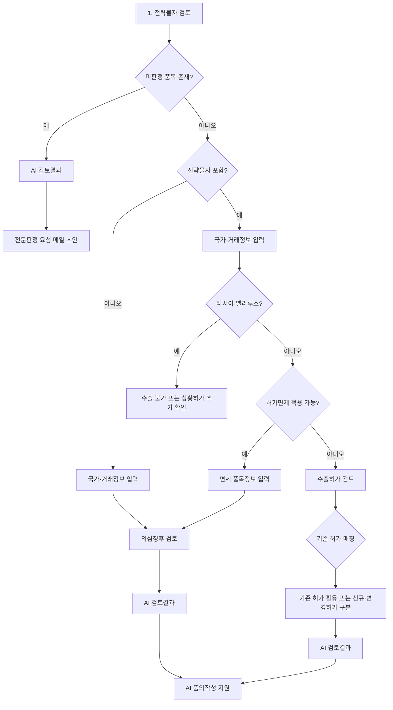

# Export License for Dual-Use Items

수출통제 제도에 익숙하지 않은 거래부서 사용자가 자신이 알고 있는 품목·국가·거래자 정보를 입력하면, 전략물자 판정부터 허가·허가면제·의심징후 검토까지 필요한 정보를 빠짐없이 정리하도록 돕는 단일 HTML 기반 업무지원 도구입니다.

이 도구는 수출 가능 여부를 독자적으로 확정하지 않습니다. 모든 판정, 허가, 허가면제, 상황허가 관련 의사결정은 통상그룹 담당자의 검토와 사내 품의 승인을 거쳐야 합니다.

- 배포 사이트: <https://jinhsong.github.io/exportlicense/>
- 실행 파일: [`index.html`](./index.html)
- 구현 방식: HTML, CSS, Vanilla JavaScript를 하나의 파일에 포함한 정적 웹페이지

## 해결하려는 문제

| 업무 영역 | 기존 어려움 | 개선한 방식 |
| --- | --- | --- |
| 판정 | 전략물자 여부, 통제번호, 판정 유효기간을 품목마다 확인하기 어렵고 대량 검토 시 누락 가능성이 있음 | 모델명으로 판정 DB를 자동 조회하고, 유효 판정만 최신순으로 제시하며, 미판정 품목은 전문판정 요청 메일 작성까지 지원 |
| 허가 | 기존 허가 사용 가능 여부, 신규·변경허가 대상, 개별·사용자포괄허가 구분을 여러 품목과 거래자별로 정리하기 어려움 | 기존 허가 DB와 자동 대조하여 재사용·변경·신규 신청을 구분하고 허가 유형별 품의 초안을 작성 |
| 허가면제 | 국가, 통제번호, 거래 목적에 따라 적용 가능한 조항과 증빙이 달라 판단 및 정보 수집이 어려움 | 단계별 문진으로 적용 가능한 조항만 표시하고 품목별 수량·중량·금액·미국산 비중 및 사후거래보고 품의 내용을 정리 |
| 의심징후 | 비전략물자도 상황허가 위험을 확인해야 하며 반복 거래의 12개 항목을 매번 수기로 검토하기 번거로움 | 의심징후 체크리스트를 제공하고 자사 법인·수출지역 정보를 이용해 일부 항목을 자동 입력하며 군·방산 키워드를 별도 확인 |

## 전체 업무 흐름



허가 신청으로 진행하는 경우에는 별도 의심징후 문진을 생략하고 AI 검토결과로 이동합니다. 나의2 지역은 허가면제가 적용되지 않으며 개별수출허가 검토로 진행됩니다.

## 6단계 구성

### 1. 전략물자 검토

- 기본 1개 품목 카드가 표시되며 품목을 추가·삭제할 수 있습니다.
- 입력 순서는 모델명, 품목명, 전략물자 통제번호입니다.
- 대량 검토에서는 모델명만 여러 줄로 입력해 한꺼번에 조회할 수 있습니다.
- 모델명을 입력하면 테스트 판정 DB가 자동 조회됩니다.
- 같은 모델명에 유효한 판정이 여러 건이면 만료 판정은 제외하고 최신 판정을 위에 표시합니다.
- DB에서 가져온 판정번호, 판정결과, 통제번호 등은 사용자가 임의로 수정할 수 없습니다.
- DB 판정결과가 비해당이면 통제번호에도 `비해당`을 표시합니다.
- 미판정 품목은 HS 번호, 규격, 용도, 비고를 추가로 받습니다.
- HS 번호를 모르는 경우 테스트 HS DB가 추천값을 제시합니다.
- 고위험 품목명 키워드가 감지되면 수출 전 판정을 받도록 경고합니다.
- GPU 관련 품목은 판정 신청 시 GPU 모델명을 기입하도록 안내합니다.

미판정 품목이 하나라도 있으면 다른 검토를 진행하지 않고 AI 검토결과로 이동한 뒤 전문판정 요청 메일 초안을 제공합니다.

### 2. 허가면제 검토

- 국가 입력, 거래정보 입력, 면제조항 확인, 품목별 추가정보 입력 순서로 진행합니다.
- 국가명과 국가코드를 인식하고 가·나의1·나의2 지역을 구분합니다.
- 구매자, 최종수하인, 최종사용자는 각각 여러 건을 추가할 수 있습니다.
- 세 거래자가 동일한 경우 한 번에 복사하는 기능을 제공합니다.
- 자사 법인 DB와 일치하는 거래자는 이후 의심징후 자동 입력에 활용합니다.
- 러시아·벨라루스는 제재 로직을 우선 적용해 AI 검토결과로 이동합니다.
- 나의2 지역은 허가면제를 허용하지 않고 개별수출허가로 진행합니다.
- 통제번호에 따라 적용할 수 없는 면제조항은 표시하지 않습니다.
- 제9호는 `5A002.a.1~a.4`, `5B002`, `5D002` 및 그 하위 항목에만 표시합니다.
- 적용 조항에 따라 추가 확인질문을 표시하고 필요한 증빙을 안내합니다.
- 면제 대상 품목별로 중량, 수량, 단가, 수출액, 미국산 비중을 입력합니다.
- 수출액은 수량과 단가를 곱해 자동 계산합니다.

### 3. 수출허가 검토

- 개별수출허가와 사용자포괄수출허가를 구분합니다.
- 앞 단계의 모델명, 국가, 구매자, 최종수하인, 최종사용자를 기존 허가 DB와 대조합니다.
- 모든 조건이 일치하면 기존 허가 활용 대상으로 안내합니다.
- 일부 전략물자만 허가가 없으면 미허가 품목만 신규 또는 변경허가 대상으로 분리합니다.
- 나의2 지역은 개별수출허가로 자동 진행하며 허가 가능성이 낮다는 안내를 표시합니다.

개별수출허가에서는 최종도착지 항구·공항, 운송방법, 제조자와 품목별 단가·수량·중량·수출액을 받습니다. 사용자포괄수출허가에서는 품목별 구매자·최종수하인·최종사용자를 연결하고 최종사용용도와 홈페이지를 받습니다.

### 4. 의심징후 검토

- 상황허가 위험을 확인하기 위한 12개 의심징후를 예·아니오로 점검합니다.
- `모두 아니오` 버튼으로 수기 입력 대상 항목을 한 번에 처리할 수 있습니다.
- 자동 입력되지 않은 항목을 위에, 자동 입력된 항목을 아래에 배치합니다.
- 구매자·최종수하인·최종사용자가 같은 자사 법인이면 지정된 항목을 자동으로 아니오 처리합니다.
- 최종수하인 또는 최종사용자가 자사 법인인 경우 역할에 맞는 일부 항목을 자동 입력합니다.
- 가 지역은 기술수준 관련 항목을 자동으로 아니오 처리합니다.
- AI 검토결과에서는 수기·자동 입력 결과를 한 표에 모아 표시하고 자동 입력 근거는 `자사 법인`으로 표시합니다.
- 의심징후가 하나라도 예이면 증빙자료로 우려를 해소하도록 안내하고, 해소가 어려우면 허가 검토를 안내합니다.

거래자명 또는 최종사용용도에 군·정부기관, 방산, 항공우주, 군사용도, 대량살상무기 관련 키워드가 감지되면 실제 군·방산 거래 또는 군사적 용도인지 사용자에게 추가로 확인합니다. 사용자가 해당한다고 답하면 방위사업청 허가 가능성과 통상그룹 검토 필요성을 안내합니다.

### 5. AI 검토결과

- 입력한 모든 품목을 표로 요약합니다.
- 국가·지역, 거래자, 판정결과, 기존 허가 매칭, 면제조항, 의심징후 결과를 종합해 다음 업무를 안내합니다.
- 허가 유형별 제출서류와 제출 불필요 서류를 구분합니다.
- 가 지역과 통제번호 조합에 따라 최종사용자 서약서 별지 2의2·2의3을 구분합니다.
- DB에서 조회된 전문판정서·자가판정서 정보는 신청정보에 자동 반영하고 별도 제출 불필요로 안내합니다.
- 결과 보고서를 단일 HTML 파일로 다운로드할 수 있습니다.

### 6. AI 품의작성 지원

- 전문판정이 필요한 경우에는 품의서 대신 전문판정 요청 메일 초안을 제공합니다.
- 허가면제 대상은 사후거래보고 품의 초안을 제공합니다.
- 개별수출허가는 거래·거래자·품목 정보를 반영한 신청 품의 초안을 제공합니다.
- 사용자포괄수출허가는 품목별 거래자 연결정보를 반영한 신청 또는 변경허가 품의 초안을 제공합니다.
- 기존 허가를 그대로 사용할 수 있거나 전략물자 비해당인 경우에는 불필요한 품의 초안을 만들지 않습니다.
- 별도 탭에서 통상그룹 담당자가 후속 업무를 대행한다는 안내를 확인할 수 있습니다.

초안은 입력값과 테스트 DB를 바탕으로 만든 보조자료입니다. 실제 발송·상신 전 통상그룹 담당자가 최신 고시, 판정서, 허가서 및 거래서류와 대조해야 합니다.

## 테스트 DB와 교체 위치

현재 데이터는 기능 검증을 위한 샘플이며 `index.html`의 JavaScript 상수로 포함되어 있습니다.

| 상수 | 용도 |
| --- | --- |
| `COUNTRY_CODES`, `REGION_INFO` | 국가명·국가코드 인식 및 지역 구분 |
| `EXEMPTIONS`, `EX_PURPOSE`, `EX_CONFIRM` | 허가면제 조항, 목적, 확인질문 |
| `SAMPLE_MODEL_DB` | 자가판정·전문판정 샘플 데이터 |
| `SAMPLE_HS_DB` | 미판정 품목의 HS 번호 추천 데이터 |
| `HIGH_RISK_GROUPS` | 전략물자 고위험군 품목명 키워드 |
| `COMPANY_DB` | 자사 해외 법인 샘플 데이터 |
| `SAMPLE_EXPORT_LICENSE_DB` | 기존 개별·사용자포괄수출허가 샘플 데이터 |
| `DEFENSE_PARTY_KEYWORDS` | 군·정부기관·방산 거래자 감지 키워드 |
| `DEFENSE_ENDUSE_KEYWORDS` | 군사용도·WMD 관련 최종사용용도 키워드 |
| `RED_FLAGS` | 의심징후 12개 항목 |

실제 DB로 교체할 때는 현재 객체의 필드명을 유지하거나, 별도 변환 함수를 두어 화면에서 사용하는 형식으로 정규화하는 방식이 안전합니다. 판정 DB에는 최소한 모델명, 품목명, 통제번호, 판정결과, 판정번호, 발급일, 유효기간, HS 번호가 필요합니다. 기존 허가 DB에는 허가유형, 허가번호, 국가, 구매자, 최종수하인, 최종사용자, 모델명, 유효기간이 필요합니다.

## 로컬 실행

별도 빌드나 패키지 설치가 필요하지 않습니다.

1. 저장소를 내려받습니다.
2. `index.html`을 브라우저에서 엽니다.
3. 모델명 샘플 채우기 또는 직접 입력으로 전체 흐름을 시험합니다.

브라우저 보안정책에 따라 일부 기능이 제한되면 저장소 폴더에서 간단한 정적 서버를 실행할 수 있습니다.

```powershell
python -m http.server 8000
```

이후 `http://localhost:8000/`에 접속합니다.

## 데이터 저장 방식

- 입력 중인 초안은 브라우저 `localStorage`의 `exportlicense_draft_v3` 키에 저장됩니다.
- 초안 보존기간은 14일이며 같은 브라우저·같은 기기에서만 복구됩니다.
- 서버 또는 GitHub로 사용자의 입력값을 전송하는 애플리케이션 코드는 없습니다.
- 결과 보고서는 브라우저에서 생성되어 사용자의 기기에 HTML 파일로 다운로드됩니다.
- 페이지는 Google Fonts와 jsDelivr의 외부 폰트 리소스를 불러옵니다.

## 보안 및 운영 주의사항

- GitHub Pages와 이 저장소는 공개 상태이므로 소스 코드와 포함된 샘플 DB는 누구나 볼 수 있습니다.
- 실제 판정·허가·법인 DB의 기밀 데이터를 `index.html`에 직접 넣으면 공개됩니다. 운영 DB 연결 시 인증과 접근통제가 적용된 사내 API 또는 별도의 내부 배포환경을 사용해야 합니다.
- 현재 입력값은 브라우저에 남을 수 있으므로 공용 PC 사용 후에는 화면의 초기화 기능 또는 브라우저 사이트 데이터 삭제가 필요합니다.
- 이 도구는 규칙 기반 검토 보조도구입니다. 화면의 `AI 검토결과`와 `AI 품의작성 지원`이라는 명칭은 입력값을 규칙에 따라 조합한 결과이며, 외부 생성형 AI API가 법적 판단을 수행하지 않습니다.
- 국가 분류, 제재, 고시, 제출서류는 변경될 수 있으므로 운영 전 최신 규정과 사내 정책을 반영해야 합니다.
- 키워드 검사는 오탐·미탐 가능성이 있으므로 최종 판단 근거로 단독 사용하면 안 됩니다.

## 배포

현재 사이트는 GitHub Pages로 공개됩니다. 배포 전에는 다음을 확인합니다.

1. `index.html`의 주요 분기와 모바일 화면을 확인합니다.
2. `git diff --check`로 공백 오류를 확인합니다.
3. 의도한 파일만 커밋합니다.
4. 배포 브랜치에 푸시한 뒤 GitHub Pages의 배포 완료 상태를 확인합니다.

공개 사이트에 방문자 수 집계가 필요할 경우 GitHub Pages 자체 기능만으로는 정확한 사용자 통계를 제공하기 어렵습니다. 사내 정책이 허용하는 로그 수집 방식 또는 별도 분석 도구 도입 여부를 검토해야 합니다.

## 저장소 구조

```text
exportlicense/
├─ index.html   # 화면, 스타일, 상태, 업무 규칙, 테스트 DB 전체
└─ README.md    # 기능 및 운영 문서
```

단일 파일 구조는 배포와 전달이 간단하지만 코드와 데이터 규모가 커질수록 유지보수가 어려워집니다. 실제 DB 연동 단계에서는 화면, 업무 규칙, 데이터 접근 계층을 분리하고 자동화 테스트를 추가하는 것을 권장합니다.
